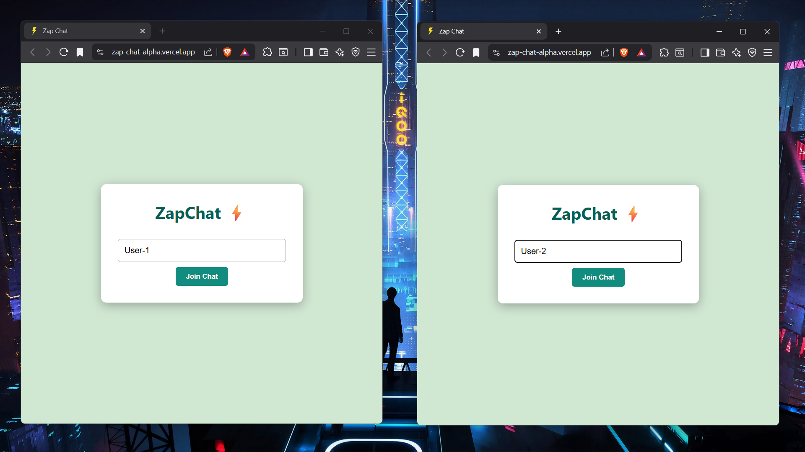
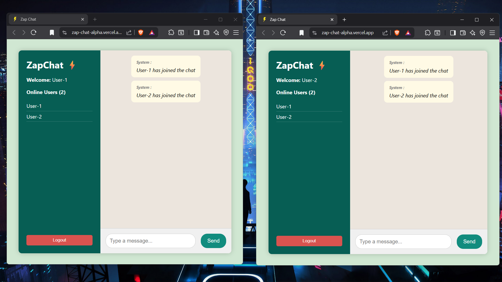
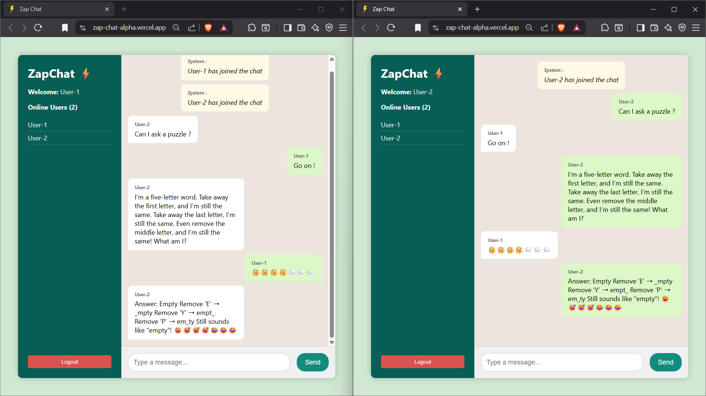

# MERN Stack Web Development  
______________________________________  
**COMPANY** : CODTECH IT SOLUTIONS  
**NAME** : SUDHIR K  
**INTERN ID** : CT08DM1071  
**DOMAIN** : MERN STACK WEB DEVELOPMENT  
**DURATION** : 8 WEEKS  
**MENTOR** : NEELA SANTOSH  

---

## 📝 Internship Work Summary

As part of my internship at CodTech IT Solutions, I designed and developed a full-stack real-time chat application named ZapChat, which simulates the core functionality of a modern messaging platform. This project helped me gain practical experience in building real-time web applications using React, Socket.IO, and Node.js—core technologies within the MERN stack ecosystem.

The idea behind ZapChat was to implement instant messaging using WebSockets, allowing users to communicate in real time. I started the project by building the backend using Node.js and Express, where I integrated Socket.IO to manage real-time bidirectional communication between the server and connected clients. Each user connects to the server through a persistent WebSocket connection, enabling the exchange of messages without requiring page reloads or polling.

One of the primary features I implemented was group chat functionality using chat rooms. Each client can join a specific room, and messages sent in that room are broadcast only to participants of that room. This structure simulates the real-world behavior of chat applications like WhatsApp or Slack, where multiple users can engage in different group conversations simultaneously.

On the frontend, I used React.js to build a clean, modern user interface. I focused on building reusable components for the chat window, message bubbles, input fields, and room join interface. I styled the UI using custom CSS, ensuring it was both visually appealing and mobile-responsive.

To enhance usability, I implemented auto-scroll behavior, which ensures that users always see the latest messages as they are received. This required handling DOM updates and scroll positioning dynamically inside React's component lifecycle. I also added smooth transitions and minimal animations to improve the overall user experience.

One challenge was enabling cross-origin communication between the frontend (hosted on Vercel) and backend (hosted on Render). I configured CORS properly on the Express server, ensuring seamless communication between different domains.

Another aspect I paid attention to was error handling—such as handling disconnected clients, duplicate usernames, and empty messages—to ensure the application could handle edge cases without breaking. During development, I frequently tested the app with multiple users across devices and browsers to ensure real-time synchronization remained smooth and consistent.

The deployment process gave me hands-on experience with cloud platforms. I deployed the frontend using Vercel, which offered quick and seamless integration with my GitHub repository. The backend was deployed on Render, which allowed me to easily host the Socket.IO server and expose public endpoints for testing and use.

---
## 📸 Demo Screenshots

### 🌤️ Login page 


### 🔍 Users-Joined


### 🌤📤 Chat room messages


---
# ⚡ZapChat — Real-Time Chat Application

ZapChat is a real-time, full-stack chat application built using the **React** and **Socket.IO**. It allows users to send and receive messages instantly, simulating a basic version of a modern messaging platform.

---
## Live Demo 

 🌐 [zap-chat-alpha.vercel.app](https://zap-chat-alpha.vercel.app)  

---
## ✨ Features

- ⚡ **Real-Time Messaging** – Instant chat using WebSockets (Socket.IO)
- 🧑‍🤝‍🧑 **Group Chat Simulation** – Join and chat with others in shared rooms
- 🎨 **Modern UI** – Built with React and styled using custom CSS
- 📱 **Responsive Design** – Works seamlessly on mobile and desktop browsers
- 🔁 **Auto-Scroll** – Automatically scrolls to the latest message
- ☁️ **Fully Hosted** – Frontend on **Vercel**, backend on **Render**
- 🔒 **CORS Enabled** – Smooth cross-origin communication
  
---
## 🧱 Tech Stack

### 🔹 Frontend
- React.js
- CSS3 (custom styling)
- Socket.IO Client

### 🔹 Backend
- Node.js
- Express.js
- Socket.IO Server
- CORS

### 🔹 Deployment
- **Frontend**: [Vercel](https://vercel.com)
- **Backend**: [Render](https://render.com)


---
## 🛠️ Getting Started Locally

### 1️⃣ Backend

```bash
cd server
npm install
npm run dev
```
### 2️⃣ Frontend

```bash
cd client
npm install
npm run dev
```
--- 
Created by Sudhir💖
[Github Profile](https://github.com/SudhirKannan/)
